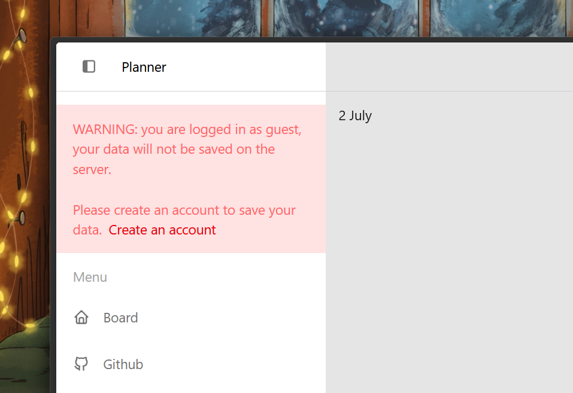

# Planner App
Planner is a distraction-free planning tool for forward-thinkers and helps you map your goals and tasks.

        

# Overview


---
# Features
## Pick your timeline
Look at your daily, weekly, monthly, and yearly goals all in one place.


---
## Manage your goals and tasks
No more staring at huge goals feeling overwhelmed. Break them down into smaller pieces so that you can tackle individually.


---
## Store your data locally
Planner allows you to continue as a guest without the need to register an account.



---
# Development
1. Install the project
```
git clone https://github.com/kahseng-dev/planner.git
cd planner\web
bun install
```

2. Configure your `application.yaml` under `planner\src\main\resources\application.yaml`
```
spring:
  application:
    name: planner
  datasource:
    url: jdbc:mysql://localhost:3306/planner-db
    username: {YOUR_SQL_USERNAME} 
    password: {YOUR_SQL_PASSWORD} 
```

3. Start the frontend web application using
```
bun run dev
```

4. Start the backend springboot application using
```
./mvnw spring-boot:run
```
If you're on Windows:
```
./mvnw.cmd spring-boot:run
```

5. Once running, the application will be available at:
```
http://localhost:5173/
```

# Shoutouts
Thank you for the introduction tutorials and educational resources:
- Mosh Hamedani, OktaDev, and EmbarkX - React Frontend and Springboot Intergration
- Sergio Lema - Spring Security and JWT Authentication